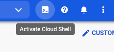
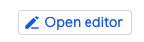
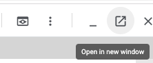

# Eneco Advanced Kubernetes Training

# 📄 Details

The course will be held on 8 and 9 July (Monday, Tuesday) at Eneco World, Marten Meesweg 5, Rotterdam and will run from 09:00 - 17:00

The days will be split up as follows:
- Day 1: Teaching on various Kubernetes topics combined with exercises
- Day 2: A hackathon to apply what is learned

# Slides

PDFs of the slides will be made available after the course.

# 🛠 Setup

For this course you'll need the following:
- An [Instruqt account](https://play.instruqt.com/signup) (🚨 the mail address of this account needs to be shared with the trainers)
- A [Google Cloud Platform account](https://accounts.google.com/) (🚨 the mail address of this account needs to be shared with the trainers)
- A local machine running:
  - a code editor
  - [git](https://git-scm.com/book/en/v2/Getting-Started-Installing-Git)
  - [kubectl](https://kubernetes.io/docs/tasks/tools/#kubectl)
  - [Docker](https://docs.docker.com/engine/install/)
  - [gcloud](https://cloud.google.com/sdk/docs/install-sdk)
  - [helm](https://helm.sh/docs/intro/install/) (optional)
  - [helmfile](https://github.com/helmfile/helmfile/releases) (optional)
  - [k9s](https://k9scli.io/topics/install/) (optional)

> Note: There are sometimes limitations with company laptops in which case we recommend making use of Google Cloud Shell, see below for more details.

 

You can signup for an account by going to [this](https://accounts.google.com/signin) page and selecting "Create account".  If you already have a gmail account this can also be used.

## Instruqt account

You'll need to setup an account in Instruqt, which can be done [here](https://play.instruqt.com/signup).
In order to give you access to the course material, please share the mail address used to setup the account with the trainers.

## Google Cloud Platform (GCP) account

If you already have a Gmail account, congratulations 🎉, you have a Google Cloud Platform account!  Please share the corresponding mail with the trainers.  

Signing up for a GCP account can be done [here](https://accounts.google.com/signin) (select "Create account")

## Local Machine setup

Installation instructions for the technologies:
- [git](https://git-scm.com/book/en/v2/Getting-Started-Installing-Git)
- [kubectl](https://kubernetes.io/docs/tasks/tools/#kubectl)
- [Docker](https://docs.docker.com/engine/install/)
- [gcloud](https://cloud.google.com/sdk/docs/install-sdk)
- [gcloud kubectl plugin](https://cloud.google.com/kubernetes-engine/docs/how-to/cluster-access-for-kubectl#install_plugin).

### gcloud setup

`gcloud` installation can be a bit fiddly but generally goes as follows:
1. Download the package for your system and extract the files
2. Run the install script using `./google-cloud-sdk/install.sh`
3. Install the required `gke-gcloud-auth-plugin`, instructions [here](https://cloud.google.com/kubernetes-engine/docs/how-to/cluster-access-for-kubectl#install_plugin)
4. Open a new terminal instance
5. Authenticate with `gcloud auth login`

If you have any issues with the setup, not to worry, we'll help get you setup at the training.

## Google Cloud Shell

If you have any issues with the above setup on your local machine, consider using Google Cloud Shell. 
It provides a cloud version of VS Code with access to all required Docker tooling.

Setup instructions are as follows:

1. Ensure you have a Google Cloud Platform account

2. Go to https://console.cloud.google.com

3. Select "Activate Cloud Shell"

   

4. Select Open editor

   

5. Select Open in New Window

    

You should now be able to see a code editor environment much like VS Code.  To access a terminal, select "Terminal"->"New Terminal"

>  Note that if your browser uses cookie blockers like UBlock Origin, you may need to disable them.

Important to note is that your Cloud Shell instance will be put to sleep after 20 minutes of inactivity.  Starting it back up again takes a few seconds.

# ⚠️ Any issues encountered?

If you encounter any issues or have questions, feel free to message the trainers or just add an issue to this repo.
